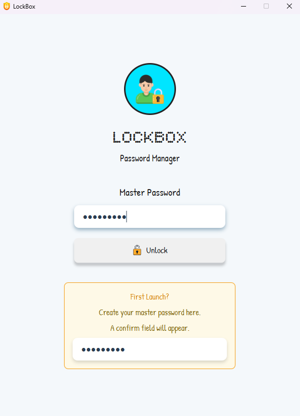
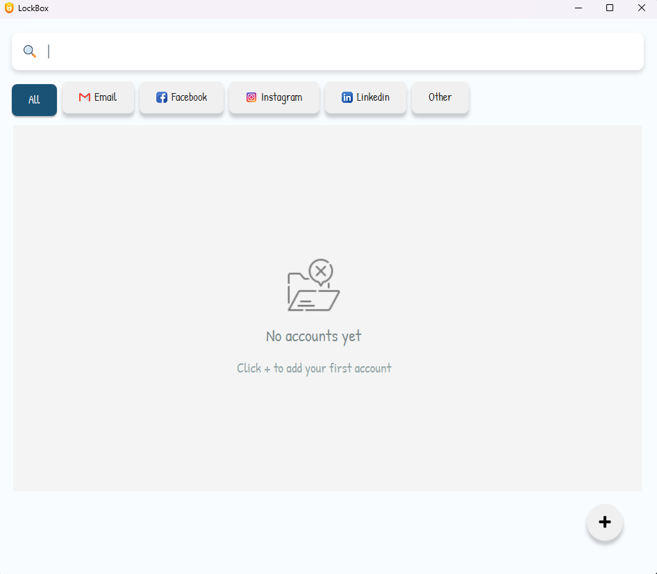
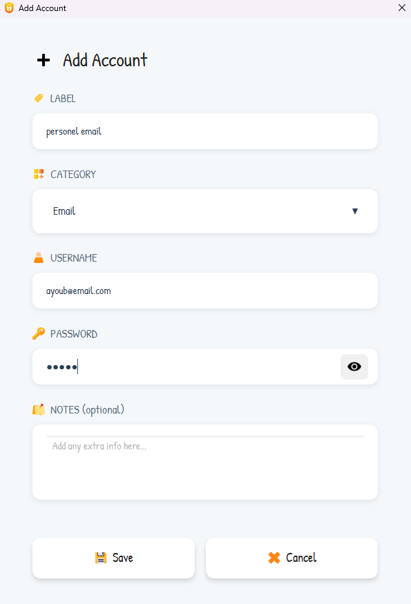
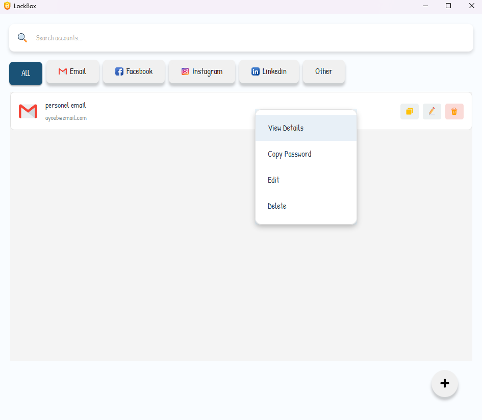
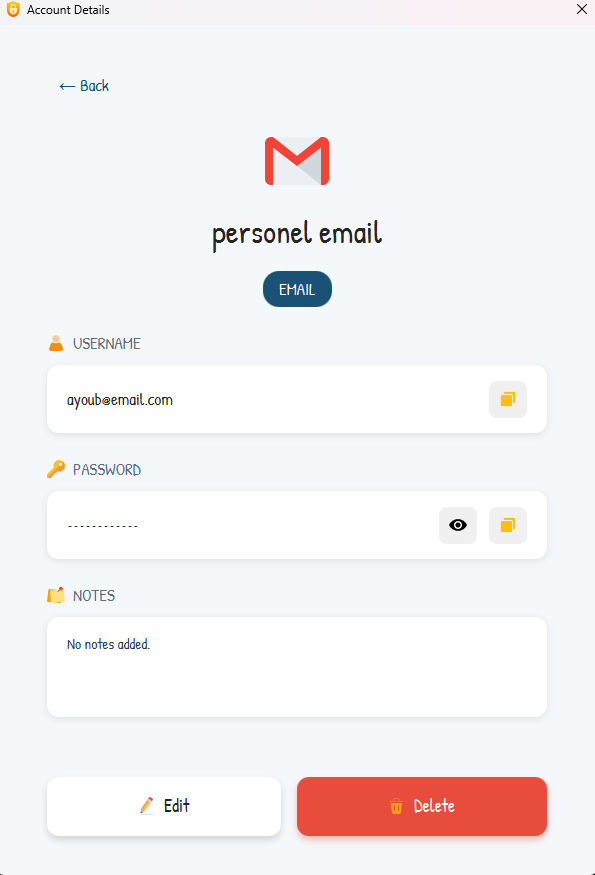
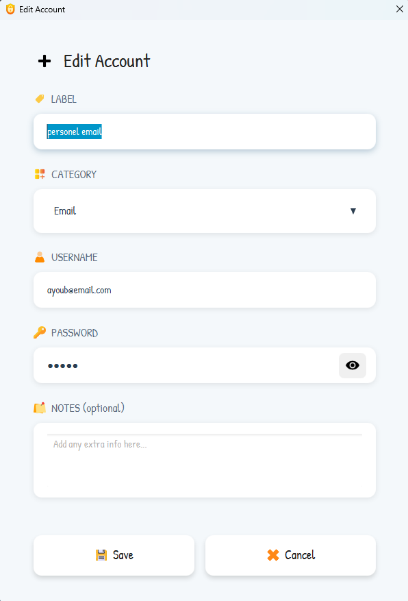
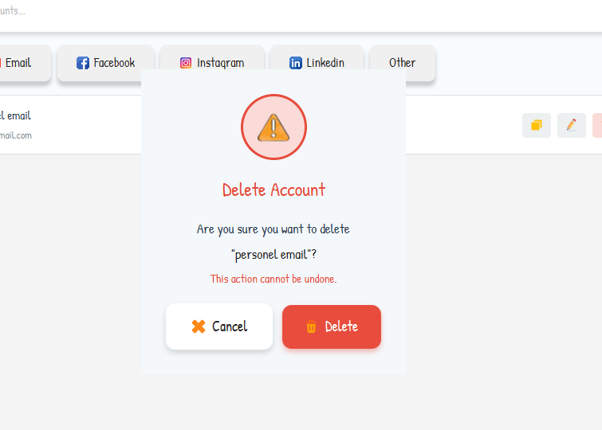

# LockBox - Password Manager

A secure, offline password manager built with JavaFX 17 and AES-256-GCM encryption.

---

## Table of Contents
- [Features](#features)
- [Security](#security)
- [Prerequisites](#prerequisites)
- [Running the App](#running-the-app)
- [Building the App](#building-the-app)
- [How It Works](#how-it-works)

---

## Features

- Master password protection with PBKDF2 key derivation
- AES-256-GCM encryption for all stored data
- Category filtering (Email, Facebook, Instagram, LinkedIn, Other)
- Real-time search across accounts
- One-click copy username/password to clipboard
- Show/hide password toggle
- Add, edit, delete accounts
- Right-click context menu on account cards
- Atomic file writes to prevent data corruption
- Clean, modern UI with toast notifications

---

## Security

| Feature | Implementation |
|---|---|
| Encryption | AES-256-GCM |
| Key Derivation | PBKDF2WithHmacSHA256 |
| Iterations | 100,000 |
| Salt | 32 bytes (random per lockBox) |
| IV | 12 bytes (random per save) |
| Storage | Local encrypted file `lockBox.enc` |
| Memory | Password stored as `char[]`, wiped after use |

---

## Prerequisites

- Java 17+
- JavaFX SDK 17+ (external)
- JavaFX jmods 17+ (for packaging only)
- Maven 3.8+

---

## Running the App

### Using Maven (recommended)
```bash
mvn javafx:run
```

### Using java directly
```bash
java --module-path "C:\path\to\javafx-sdk\lib" \
     --add-modules javafx.controls,javafx.fxml,javafx.graphics \
     -jar target\LockBox-1.0-SNAPSHOT.jar
```

### Using batch file (Windows)
Create `run.bat` next to the JAR:
```batch
@echo off
java --module-path "C:\Me\programs\javafx-sdk-17.0.17\lib" ^
     --add-modules javafx.controls,javafx.fxml,javafx.graphics ^
     -jar LockBox-1.0-SNAPSHOT.jar
pause
```

---

## Building the App

### Step 1 - Build the JAR
```bash
mvn clean package
```

### Step 2 - Create standalone EXE
```bash
jpackage --input target --name LockBox --main-jar LockBox-1.0-SNAPSHOT.jar --main-class com.ayoub.lockBox.Main --type app-image --module-path "C:\Me\programs\javafx-jmods-17.0.18" --add-modules javafx.controls,javafx.fxml,javafx.graphics
```

This creates a `LockBox/` folder with a standalone `LockBox.exe` that works without Java installed.

> **Note:** `--module-path` must point to your **JavaFX jmods** folder (not the SDK).
> Download jmods from: https://gluonhq.com/products/javafx/

---

## How It Works

### First Launch
1. App detects no `lockBox.enc` file
2. User sets a master password
3. App creates an empty encrypted LockBox

### Login
1. User enters master password
2. App reads salt from lockBox file
3. PBKDF2 derives encryption key from password + salt
4. App decrypts lockBox with the key
5. If decryption succeeds → login successful

### Saving Accounts
1. App derives key from master password
2. Serializes accounts to JSON
3. Encrypts JSON with AES-256-GCM (new random IV each time)
4. Writes encrypted data atomically to `lockBox.enc`

---

---

## Screenshots

| Login | Dashboard | Add Account |
|-------|-----------|-------------|
|  |  |  |

| Menu | Account Details | Edit Account | Delete Account |
|------|-----------------|--------------|----------------|
|  |  |  |  |
```